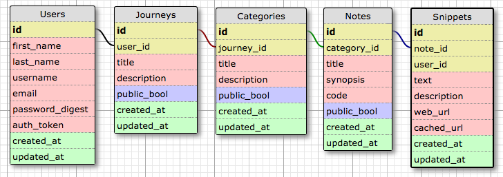

<!---  -->
#Welcome to Re: Source

Re: Source is a tool designed to enhance your code-learning journey. Consolidate all useful bits of information you find while exploring new concepts into an intuitive structure for immediate reflection and future reference.

#Project Operating Agreement

##Stand-ups
Come prepared.
* What did you do?
* What do you want to do next?
* What are you struggling with?
* Did you discover any useful tips to share?
* What is your pairing preference?

Everyone answers these questions and then the floor is open for conversation. Let them get out everything.

Morning - 8:15 AM
Morning(non-technical) - 10:15 AM
Afternoon - 12:45 PM
Evening - 4:30 PM

Lunch is still 11:30-1:00. Feel free to keep coding, but you probably shouldn't be.

##Workflow
* Don't push broken code to master.
* Fork or branch, just keep it tidy people.
* Kanban whiteboard. High-five yourself and team. Confidence is contagious.
* Pair more often while working with new tech.
* Pair less often while confident it will accelerate progress.

##Group Dynamics
* Encourage lunch together as well as snack trips.
* If you feel like you need to take the night off and come fresh tomorrow, do it.
* If you're stuck for more than 20 minutes, ask a group memeber for help.
* Still stuck? Address blocker at standup, make progress somewhere else.
* We are always pseudo pairing, everyone is here to help each other.

##MVP IS EVERYTHING
####How do we get there?
* Icebox aggressively. Post it and drop it.
* Make sure everyone shares same explicit vision.
* Don't chase sunk cost.
* Limit new tech.

## Conflict Resolution
* Objective - Explain your thinking (pros/cons) such that group can agree on best course (consensus).
* Rate from 1-10 your level of concern
* Timebox to 30 minutes with vote resolution. Clock stops if a break is neaded to collect oneself.
* If vote is deadlocked, seek arbitration from Lucas/Casey/Leon/Alex

